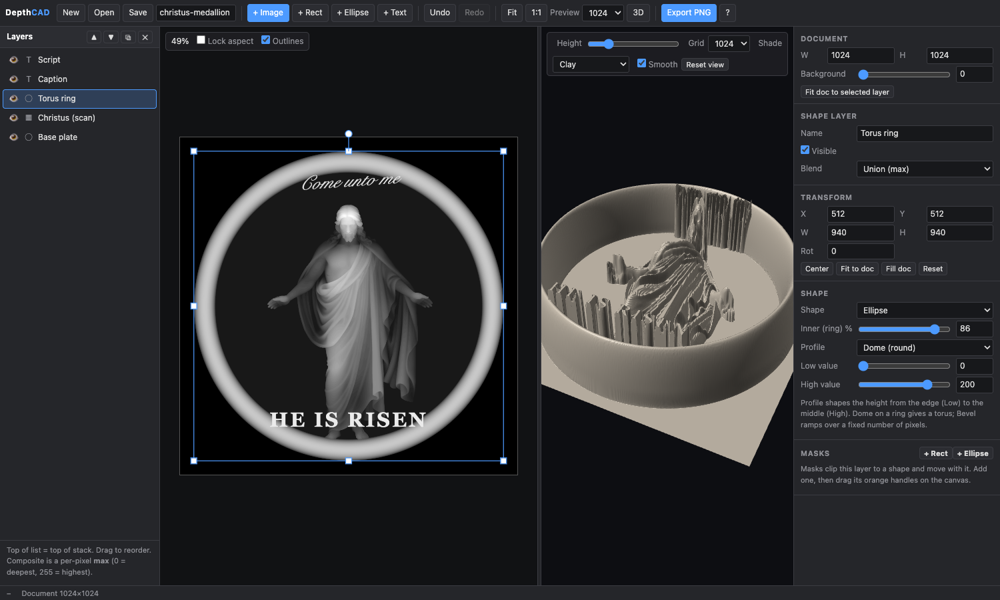
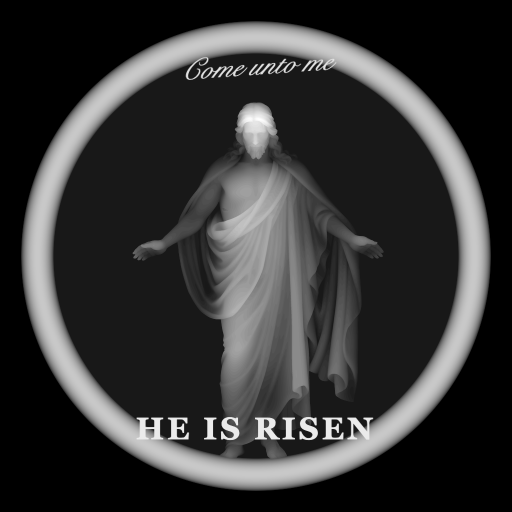
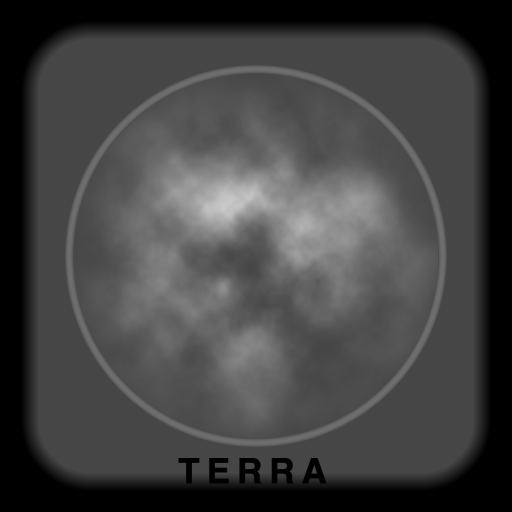
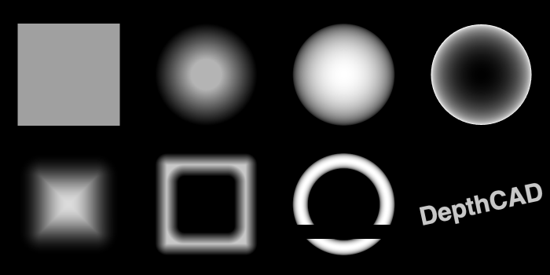

# DepthCAD

A browser-based, layer-oriented editor for building **grayscale depth maps** for laser engraving (LightBurn and friends).

Import scanned or rendered depth maps, composite them with geometric primitives and text, mask and transform each layer, preview the result as a 3D surface, and export a clean grayscale PNG.



The whole application is a single HTML file with no dependencies and no build step. Open `depthcad.html` in Chrome, Edge, Safari or Firefox and start working.

## Why

Making a good engraving depth map usually means combining several pieces of 3D information: a sculpted relief from a scan, a decorative ring or base plate, a flat area for text, a hole for a keychain. Doing that in an image editor is awkward because "max" compositing and height profiles are not first-class operations. DepthCAD treats the depth map as a stack of 3D layers and gives each one the tools that matter for engraving.

## Conventions

* **0 = deepest (black), 255 = highest (white).** This is the convention for the whole tool and for the exported PNG.
* **Layers combine with a per-pixel max** ("Union"). Overlapping geometry therefore intersects the way real solids would.
* Black (value 0) in an imported image is transparent by default, so the background of a scan never covers the layers below it.
* All coordinates are document pixels. The document size is set on first import (to the image size) and can be changed at any time.

## Features

**Layers**

* **Image layers**: import PNG/JPEG depth maps (drag and drop works). Levels controls remap the value range: input black/white, gamma, output black/white, invert. Lifting *Out black* puts a model on a pedestal.
* **Shape layers**: rectangles (optional corner radius) and ellipses, with an *inner* ratio to make rings and frames. Height profiles: flat, linear (cone), dome (a ring with the dome profile is a torus), cosine, and bevel (a ramp of a fixed number of pixels). Each shape has a low and high value.
* **Text layers**: any installed font, or a loaded `.ttf`/`.otf`/`.woff` file that is embedded in the project. Weight, italic, size, line height, letter spacing, alignment. The font menu previews every family in its own face.

**Compositing**

* Blend modes per layer: **Union** (max), **Clamp** (min: flattens whatever is under it), **Replace**, **Cut** (erases everything below inside the layer: engrave text into a surface, punch a hole), **Keep** (erases everything below outside the layer: crop to a shape).
* **Masks** belong to a layer and move with it. Rect or ellipse, keep or inverted, optional feather.

**Editing**

* Drag to move, corner and edge handles to scale, a rotation handle, numeric fields for everything. Aspect lock, Shift and Alt modifiers, arrow-key nudging.
* Unlimited undo/redo, layer reordering by drag, duplicate, hide.
* Interactive preview at a chosen resolution (export is always full resolution).
* Cursor readout of the composite value under the mouse.

**3D view**

* WebGL heightfield with orbit, zoom and pan, a height exaggeration slider, grid resolution, clay / gray / heat shading and a smoothing toggle.

**Files**

* Projects save as a single `.dcad.json` that embeds the imported images and fonts.
* Autosave to the browser's IndexedDB; the last project is restored on reload.
* Export: opaque 8-bit grayscale PNG at document resolution.

## Getting started

1. Open `depthcad.html` in a browser (double-click the file, or serve the folder with any static server).
2. Click **+ Image** (or drop a file on the window) to import a depth map. The document takes the image's size.
3. Add a **+ Ellipse**: it appears as a torus ring by default. Drag its handles to size it around the model.
4. Add **+ Text**, type a caption, pick a font.
5. Spin the 3D view to check the result, then **Export PNG**.

To try the tool immediately, open one of the projects in [`examples/`](examples/) with the **Open** button.

### Keyboard

| Key | Action |
| --- | --- |
| Drag / arrows | Move (Shift: constrain / nudge 10 px) |
| Corner or edge handle | Scale (Shift toggles aspect lock, Alt scales about the center) |
| Round handle | Rotate (Shift snaps to 15°) |
| Wheel / pinch | Zoom |
| Space + drag, middle drag, drag empty space | Pan |
| Ctrl/Cmd + Z, Ctrl/Cmd + Shift + Z | Undo, redo |
| Ctrl/Cmd + D | Duplicate layer |
| Delete | Delete layer (or selected mask) |
| Ctrl/Cmd + S, Ctrl/Cmd + O | Save, open project |
| F, 1 | Fit view, 100 % |
| Esc | Deselect |

The **?** button in the toolbar shows the same reference inside the app.

## Examples

| | |
| --- | --- |
|  | **[christus-medallion](examples/christus-medallion.dcad.json)**: a scanned relief on a flat base plate, clipped by a feathered circular mask, with a torus ring and two text captions. |
|  | **[terrain-coaster](examples/terrain-coaster.dcad.json)**: a bevelled rounded-rect base, a height-remapped terrain clipped to a circle, a rim, a Clamp layer that flattens the peaks, and a label engraved with Cut mode. |
|  | **[shapes-primer](examples/shapes-primer.dcad.json)**: one of everything. Every profile, a frame, a torus, Clamp and Cut layers, an inverted image with a mask, rotated text. |

The example images live in `examples/assets/`. The Christus relief is included at 1024 px for size.

## LightBurn notes

* Export, then import the PNG into LightBurn as an image and set the image mode to **Grayscale** (or your controller's equivalent). Because 0 is deepest, the engraver removes the most material where the map is black.
* Set the document size to match your engraving resolution. A 100 mm piece at 0.1 mm/pixel is a 1000 px document. Export is always at document resolution, so the preview setting does not affect the output.
* Keep flat regions at exactly the same value (shape layers guarantee this); avoid gradients in areas you want to remain smooth after multiple passes.
* Values are 8-bit. A 3D print or deep engraving with hundreds of steps will show terracing that is inherent to the format, which the 3D view's *Smooth* toggle hides for viewing only.

## Project file format

A project is JSON:

```jsonc
{
  "app": "DepthCAD", "version": 1, "name": "medallion",
  "doc": { "w": 1024, "h": 1024, "bg": 0 },
  "layers": [ /* bottom to top */
    { "id": "…", "type": "image", "name": "…", "visible": true, "mode": "max",
      "x": 512, "y": 512, "sx": 1, "sy": 1, "rot": 0,
      "imageId": "…", "inB": 0, "inW": 255, "outB": 0, "outW": 255, "gamma": 1, "invert": false, "zeroAlpha": true,
      "masks": [ { "kind": "ellipse", "x": 0, "y": 0, "w": 820, "h": 820, "rot": 0, "invert": false, "feather": 6 } ] },
    { "type": "ellipse", "w": 940, "h": 940, "inner": 0.86, "corner": 0, "profile": "dome", "bevel": 50, "low": 0, "high": 200, "…": "…" },
    { "type": "text", "text": "HE IS RISEN", "family": "Georgia", "weight": "700", "italic": false, "size": 62,
      "lineHeight": 1.2, "spacing": 6, "align": "center", "value": 235, "layout": { "kind": "linear" }, "…": "…" }
  ],
  "images": { "<id>": { "dataURL": "data:image/png;base64,…", "w": 1024, "h": 1024 } },
  "fonts":  { "<id>": { "name": "Chalkduster", "dataURL": "data:font/ttf;base64,…" } }
}
```

Layer `x`/`y` is the center in document pixels; `sx`/`sy` scale the natural size (image pixels or measured text box); shapes store their size directly in `w`/`h`. Mask coordinates are in the layer's local space so masks follow the layer.

## Architecture

Everything is in `depthcad.html`, organised as:

* **State and geometry**: the project model, box transforms (`getBox`/`setBox`) shared by layers and masks.
* **Rendering**: each layer renders to its own canvas (images through a cached levels LUT, shapes through a signed-distance-field pixel loop, text through the layout table), masks are applied with `destination-in`, and the stack is composited with canvas blend modes (`lighten` is per-channel max, `darken` is min).
* **Text layouts**: `TEXT_LAYOUTS` maps a layout kind to `measure` and `draw` functions. Text on a path (inside or outside a circle) is planned as an additional entry that draws glyph by glyph.
* **2D editor**: pan/zoom view, hit testing, handle dragging.
* **3D view**: a raw WebGL heightfield; the vertex shader samples the composite as a texture and computes normals by finite differences.
* **History and persistence**: JSON snapshots for undo, IndexedDB autosave, self-contained project files.

## Development

There is no build. Edit `depthcad.html` and reload.

A headless smoke test drives the app in a local Chrome via `puppeteer-core` and checks that importing, compositing, masking, text, export and save/load all work:

```bash
npm install
npm test            # uses Google Chrome from its default macOS location; set CHROME=/path/to/chrome otherwise
```

## Roadmap

* Text along a circular path (inside and outside).
* Feathered edges and height profiles for image layers.
* 16-bit PNG export for controllers that support it.

## License

MIT, see [LICENSE](LICENSE).
